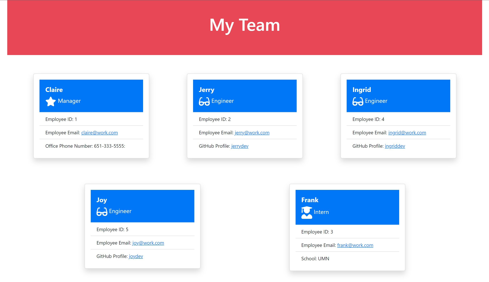

  
  # team-profile-generator
  

  ## Description
  Command-line application that takes information about employees and generates an html webpage that displays summaries of each team member.

  ## Preview
  
  [Video Walk-Thru](https://watch.screencastify.com/v/yD0gJww3qFtLNYBE5mKD)

  ## Table of Contents
  * [Installation](#Installation)
  * [Usage](#Usage)
  * [Credits](#Credits)
  * [License](#License)
  * [Contributions](#Contributions)
  * [Test](#Test)
  * [Questions](#Questions)
  * [Credits](#Credits)
  * [Resources](#Resources)
  

  ## Installation
  The user must have `Node.js` already installed on their local device. 
  
  After cloning or downloading the repository from GitHub, users open the file(s) in their Visual Studio Code or other editor, and run `node index.js` from the command line.

  ## Usage
  Make sure to run `npm install` in the terminal command line before typing `node index.js` to initialize the application. 
  
  **Make sure you are in the root directory of the file before initializing or else the program will not run.** 
  
  * Once the welcome message is displayed, enter information following each prompt for Manager, then add an Engineer, Intern, or select Done. 
  
  * Once "Done" is selected from the menu prompt, a unique team profile will be created and available for use. Located in the /dist folder, it will be named `index.html`.

  ## License
  
  
  ### MIT License

  Copyright 2022 Claire Rosenfrisk

  Permission is hereby granted, free of charge, to any person obtaining a copy of this software and associated documentation files (the "Software"), to deal in the Software without restriction, including without limitation the rights to use, copy, modify, merge, publish, distribute, sublicense, and/or sell copies of the Software, and to permit persons to whom the Software is furnished to do so, subject to the following conditions:
      
  The above copyright notice and this permission notice shall be included in all copies or substantial portions of the Software.
      
  THE SOFTWARE IS PROVIDED "AS IS", WITHOUT WARRANTY OF ANY KIND, EXPRESS OR IMPLIED, INCLUDING BUT NOT LIMITED TO THE WARRANTIES OF MERCHANTABILITY, FITNESS FOR A PARTICULAR PURPOSE AND NONINFRINGEMENT. IN NO EVENT SHALL THE AUTHORS OR COPYRIGHT HOLDERS BE LIABLE FOR ANY CLAIM, DAMAGES OR OTHER LIABILITY, WHETHER IN AN ACTION OF CONTRACT, TORT OR OTHERWISE, ARISING FROM, OUT OF OR IN CONNECTION WITH THE SOFTWARE OR THE USE OR OTHER DEALINGS IN THE SOFTWARE.
  

  ## Contributions
  Viewers can fork the repository, or download and create their own changes to prompts, css, or whatever! Comments, suggestions, or feedback can be submitted to me via the links below.

  ## Test
  Make sure to install Jest.js -- if you make any changes to the application, you may add tests to the `__tests__` folder and subsequent files. To test, type `npm run test`, or `npm test` from the command line. 
  
  * To target a specific suite, type that name following `npm test`. If the test(s) pass, you will see all green and check marks; if they fail, you will see red and messages that will direct you to the errors that need addressing.

  
  ## Questions
  If you have any questions about this project, please contact me directly at claire.rosenfrisk@gmail.com. You can view more of my work on 
   [My GitHub Profile](https://github.com/crosenfrisk).

  ## Credits
  🎉Thank you to [Kyler](https://github.com/Kyler-Mclachlan) and [Megan](https://github.com/Metelak) for their help with CSS and Bootstrap queries!

  ## Resources

  **TOOLS THAT MADE THIS PROJECT POSSIBLE**

  * [Nodejs.org](https://nodejs.org/en/)
  * [Inquirer.js](https://www.npmjs.com/package/inquirer)
  * [Jest](https://jestjs.io/docs/getting-started)

  **STYLING AIDS**

  * [Bootstrap](https://getbootstrap.com/) for grid layout and "card" styling
  * [FontAwesome](https://fontawesome.com/) for icons: star, glasses, graduation, and github.

  **ARTICLES**
* [Creating mailto: links](https://www.w3docs.com/snippets/html/how-to-create-mailto-links.html)
* [Opening new tab in browser](https://www.w3schools.com/tags/tryit.asp?filename=tryhtml_link_target)
* [Sorting items in an array](https://www.w3schools.com/jsref/jsref_sort.asp)

